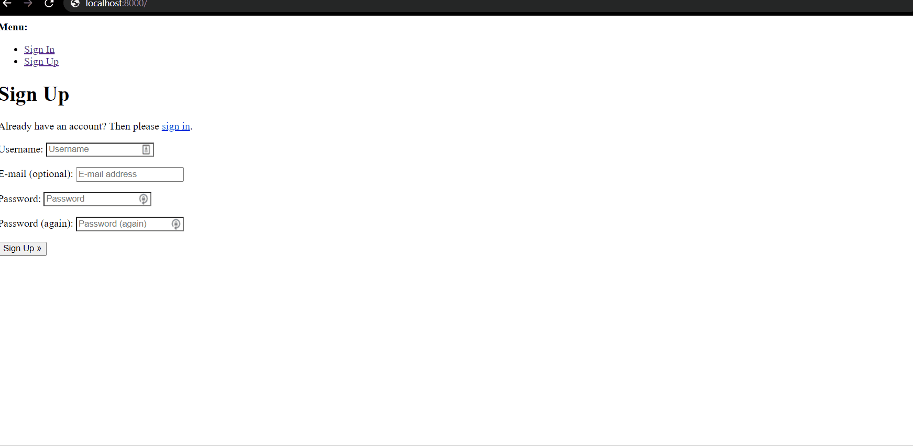

# Django Stripe Subscription

- [Django Stripe Subscription](#django-stripe-subscription)
  - [Summary](#summary)
  - [Guide to Run this](#guide-to-run-this)
  - [Stripe Subscription Payment Options](#stripe-subscription-payment-options)
  - [Billing Cycles](#billing-cycles)
  - [Project Setup](#project-setup)
  - [Add Stripe](#add-stripe)
  - [Create a Product](#create-a-product)
  - [Authentication](#authentication)
    - [Set up Django-allauth](#set-up-django-allauth)
  - [Database Model](#database-model)
  - [Get Publishable Key](#get-publishable-key)
    - [View](#view)
    - [AJAX Request](#ajax-request)
  - [Create a Checkout Session](#create-a-checkout-session)
    - [View](#view-1)
    - [AJAX Request](#ajax-request-1)
  - [User Redirect](#user-redirect)
  - [Stripe Webhooks](#stripe-webhooks)
    - [Set up the webhook endpoint](#set-up-the-webhook-endpoint)
    - [Testing the Webhook](#testing-the-webhook)
    - [Register the endpoint](#register-the-endpoint)
  - [Fetch Subscription Data](#fetch-subscription-data)
  - [Conclusion](#conclusion)

## Summary



## Guide to Run this

```cmd
git clone https://github.com/sunilale0/django-stripe-subscription.git

cd django-stripe-subscription/

// starting a virtual environment
pip -m venv venv
venv\Scripts\activate

// install requirements
pip install -r requirements.txt
```

Create a new file called `user_settings.py` in `djangostripe/`. add the following

```python
STRIPE_PUBLISHABLE_KEY="pk_test_xxxxxxxxxxxxxxxxxxxxxxxxxxxxxxxxxxxxxxxxxxxxxxxxxxxxxxxxxxxxxxxxxxxxxxxxxxxxxxxxxxxxxxxxxxxxxxxxxx"
STRIPE_SECRET_KEY="sk_test_yyyyyyyyyyyyyyyyyyyyyyyyyyyyyyyyyyyyyyyyyyyyyyyyyyyyyyyyyyyyyyyyyyyyyyyyyyyyyyyyyyyyyyyyyyyyyyyyyyy"
STRIPE_PRICE_ID="price_tttttttttttttttttttttttttttttttttttttt"
STRIPE_ENDPOINT_SECRET = "whsec_hhhhhhhhhhhhhhhhhhhhhhhhhhhhhhhhhhhh"
```

To fill up the valuees, signup at Stripe and obtain those keys. Refer to [this-section](#add-stripe) and [this-section](#create-a-product).

```cmd
python manage.py migrate
python manage.py runserver
```

## Stripe Subscription Payment Options

There are two most commont ways to implement and handle Subscriptions:

1. [Fixed-price](https://stripe.com/docs/billing/subscriptions/fixed-price) subscription
2. [Future](https://stripe.com/docs/payments/save-and-reuse#checkout) Payments

I will be going through fixed-price subscription here. The fixed-price approach is much easier to set up, but we won't have full control over the billing cycles and payments. By using this approach Stripe will automatically strat charging the customers every billing cycle after a successful checkout.

Fixed-price steps:

1. Redirect the user to Stripe Checkout (with `mode = subscription`)
2. Create a webhook that listens for `checkout.session.completed`
3. After webhook is called, save relevant data to the database

## Billing Cycles

Stripe doesn't have a default billing frequency. Every Stripe subscription's billing date is determined by the following two factors:

1. billing cycle anchor ( timestamp of subscription's creation)
2. recurring interval(daily, monthly, yearly, etc)

For example, if a customer started subscription on a 2nd of a month, and the subscription interval is monthly, the customer will be billed on the 2nd every month.

If a month doesn't have a anchor day, the subscription will be billed on the last day of the month. For example, a subscription starting on January 31 bills on February 28 (or February 29 in a leap year), then March 31, April 30, and so on.
Learn more about biling cycles [here](https://stripe.com/docs/billing/subscriptions/billing-cycle).

## Project Setup

```cmd
py -m venv venv
venv\Scripts\activate

pip install django
django-admin startproject djangostripe .
python manage.py startapp subscriptions
```

Register the app in `djangostripe/stettings.py` under `INSTALLED_APPS`:

```python
INSTALLED_APPS = [
    # "django.contrib.admin",
    # ...,
    "subscriptions.apps.SubscriptionsConfig",
]

```

Create a new view called `home` in `subscriptions/views.py`

```python
from django.shortcuts import render

def home(request):
    return render(request, "home.html")
```

Assign a URL to `home` view by adding the followling to `subscriptions/urls.py`

```python
from django.urls import path
from . import views

urlpatterns = [
    path("", views.home, name="subscriptions-home"),
]
```

Tell the main project that `subscriptions` app has its own URLs by adding the following in `djangostripe/urls.py`:

```python
from django.contrib import admin
from django.urls import path, include # new

urlpatterns = [
    # ...,
    path("", include("subscriptions.urls")), # new
]
```

Finally, create a new template called home.html inside a new folder called `templates`. Add the following HTML to the template:

```html
<!DOCTYPE hmtl>
<html lang="en">
  <head>
    <meta charset="utf-8" />
    <meta name="viewport" content="width=device-width, initial-scale=1" />
    <title>Django Stripe Subscriptions</title>
    <script
      src="https://code.jquery.com/jquery-3.5.1.min.js"
      integrity="sha384-JcKb8q3iqJ61gNV9KGb8thSsNjpSL0n8PARn9HuZOnIxN0hoP+VmmDGMN5t9UJ0Z"
      crossorigin="anonymous"
    >
      <link rel="stylesheet" href="https://stackpath.bootstrapcdn.com/bootstrap/4.5.2/css/bootstrap.mini.css" integrity="sha384-JcKb8q3iqJ61gNV9KGb8thSsNjpSL0n8PARn9HuZOnIxN0hoP+VmmDGMN5t9UJ0Z" crossorigin="anonymous">
    </script>
  </head>
  <body>
    <div class="container mt-5">
      <button type="submit" class="btn btn-primary" id="submitBtn">
        Subscribe
      </button>
    </div>
  </body>
</html>
```

Make sure to update the `settings.py` file so Django knows to look for a `templates` folder:

```python
TEMPLATES=[
    {
        # ...,
        "DIRS": ["templates"],
        # ...,
    }
]
```

Finally run `migrate` to sync the database and `runserver` to start Django's local webserver.

```cmd
python manage.py migrate
python manage.py runserver

```

Now, you visit `locahost:8000/`, you should see a `Subscribe` button.

## Add Stripe

install the latest version of stripe

```cmd
pip install stripe
```

Signup on [stripe](https://dashboard.stripe.com/register) and [dashboard](https://dashboard.stripe.com/test/dashboard) - API keys.[stripe](https://dashboard.stripe.com/register) and through [dashboard](https://dashboard.stripe.com/test/dashboard), api [link](https://dashboard.stripe.com/test/apikeys) obtain `publishable key` and `secret key`. Also, if you are signing up in Stripe for the first, don't forget to give the account name at account [settings](https://dashboard.stripe.com/settings/account).

add another file called `local_settings.py` in `djangostripe/` and fill up the following information from stripe.

```python
STRIPE_PUBLISHABLE_KEY=""
STRIPE_SECRET_KEY=""

```

## Create a Product

Now, we need to create a subscription product to sell.

Click [Products](https://dashboard.stripe.com/test/products) on the left sidebar and Add Product.
Add a product `name`, `description`, enter a `price` and select "`Recurring`". We will set billing period to `monthly`.

Now, copy the API ID of the new product we just created and save to `local_settings.py`:

```python
STRIPE_PRICE_ID = "price_adsfasdfasdfsf"

```

## Authentication

In order to associate Django users with Stripe customers and implement subscription management in the future, we'll need to enforce user authentication before allowing customers to subscribe to the service. We can achieve this by adding a `@login_required` decorator to all views that require authentication.

Let's first protect the `home` view:

```python
from django.contrib.auth.decorators import login_required
# from ...

@login_required
def home (request):
    # ...

```

Now, when non-authenticated user try to access the `home` view, they will be redirected to the `LOGIN_REDIRECT_URL` defined in `settings.py`.

### Set up Django-allauth

First install django-allauth

```cmd
pip install django-allauth
```

Update the `INSTALLED_APPS` in `djangostripe/settings.py` with the following:

```python
INSTALLED_APPS = [
    # ...,
    "django.contrib.sites",
    "allauth",
    "allauth.account",
    "allauth.socialaccount",
    #"subscriptions.apps...",
]
```

Next, add the following `django-allauth` config to `djangostripe/settings.py`:

```python
AUTHENTICATION_BACKENDS = [
    # Needed to login by username in django admin, regardless of "allauth"
    "django.contrib.auth.backends.ModelBackend",

    # "allauth" specific authentication methods, such as login by email
    "allauth.account.auth_backends.AuthenticationBackend",
]

# We have to set this variable to enable "django.contrib.sites"
SITE_ID = 1

# User will be redirected to this page after logging in
LOGIN_REDIRECT_URL= "/"

# If you don't have an email server running yet add this line to avoid any possible errors
EMAIL_BACKEND = "django.core.mail.backends.console.EmailBackend"
```

Register the allauth URLs in `djangostripe/urls.py`:

```python

# from ...

urlpatterns = [
    # ...,
    path("accounts/", include("allauth.urls")),
]

```

Apply the migrations

```cmd
python manage.py migrate
python manage.py runserver
```

Try to access `localhost:8000/`, you will be redirected to login page. Either log in or create an account and login.

## Database Model

In order to handle customers and subscriptions correctly we'll need to store some information in our database. Let's create a new model called `StripeCustomer` which will store Stripe's `customerId` and `subscriptionId` and relate it back to the Django auth user. Those ids can be used to fetch our customer and subscription data from Stripe.

Note: We could fetch the `customerId` and `subscriptionId` from Stripe every time we need them, but that would greatly increase our chance of getting rate [limited](https://stripe.com/docs/rate-limits) by Stripe.

Create model `StripeCustomer` inside `subscriptions/models.py`:

```python
from django.contrib.auth.models import User
from django.db import models

class StripeCustomer(models.Model):
    user = models.OneToOneField(to=User, on_delete=models.CASCADE)
    stripeCustomerId = models.CharField(max_length=255)
    stripeSubscriptionId = models.CharField(max_length=255)

    def __str__(self):
        return self.user.username

```

Register the model with admin in `subscriptions/admin.py`:

```python

from django.contrib import admin
from subscriptions.models import StripeCustomer

admin.site.register(StripeCustomer)

```

Create and apply migrations

```cmd
python manage.py makemigrations
python manage.py migrate
```

## Get Publishable Key

Create a new static file to hold all of our JavaScript:

```cmd
mkdir static
touch static/main.js
```

add a quick sanity check to the new `main.js` file:

```javascript
console.log("sanity check!");
```

Then update the `settings.py` to let Django knows where to find static files:

```python
STATIC_URL = "/static/"

STATICFILES_DIRS = [Path(BASE_DIR).joinpath("static")]

```

Add the static template tag along with the new script tag inside the HTML Template:
Here are the lines I am going add in `templates/home.html`, put them in the right place if you know how to if not, check my repo `templates/home.html` and find where they are located and put them in accordingly:

```html


<script src="https://js.stripe.com/v3/"></script>
<script src=""></script>
```

if you run the server and look at JavaScript console, you should see `Sanity Check!` posted

### View

Next, add a new view to `subscriptions/views.py` to handle the AJAX request:

```python

@csrf_exempt
# from ...
# 3 new imports
from django.conf import settings
from django.http.response import JsonResponse
from django.views.decorators.csrf import csrf_exempt

@csrf_exempt
def stripe_config(request):
    if request.method == "GET":
        stripe_config = {"publicKey": settings.STRIPE_PUBLISHABLE_KEY}
        return JsonResponse(stripe_config, safe=True)

```

Add a new URL in `subscriptions/urls.py`

```python
path("config/", views.stripe_config),
```

### AJAX Request

Next, use the Fetch API to make a AJAX request to the new `/config/` endpoint in `static/main.js`. add the following to `static/main.js`:

```javascript
fetch("/config/")
  .then((result) => result.json())
  .then((data) => {
    const stripe = Stripe(data.publicKey);
  });
```

The response `result` from a fetch request is a [ReadableStream](https://developer.mozilla.org/en-US/docs/Web/API/ReadableStream).
We use `result.json()` to resolve the promise and obtain `data`, which happens to have a `publickey` member in it.

## Create a Checkout Session

Now, we will attach an even handler to the button's click event which will send another AJAX request to the server to generate a new Checkout Session ID.

### View

add a new view in `subscriptions/views.py`

```python
import stripe

@csrf_exempt
def create_checkout_session(request):
    if request.method == "GET":
        domain_url = "http://localhost:8000/"
        stripe.api_key = settings.STRIPE_SECRET_KEY
        try:
            checkout_session = stripe.checkout.Session.create(
                client_reference_id = request.user.id if request.user.is_authenticated else None,
                success_url=domain_url + "success?session_id={CHECKOUT_SESSION_ID}",
                cancel_url=domain_url + "cancel/",
                payment_method_types= ["card"],
                mode = "subscription",
                line_items=[
                    {
                        "price": settings.STRIPE_PRICE_ID,
                        "quantity": 1,
                    }
                ]
            )
            return JsonResponse({"sessionId": checkout_session["id"]})
        except Exception as e:
            return JsonResponse({"error": str(e)})

```

### AJAX Request

Register the checkout session URL by adding the following in `subscriptions/urls.py`:

```python
path("create-checkout-session/", views.create_checkout_session),

```

Add the event handlre and seubsequent AJAX request to `static/main.js`:

```javascript
console.log("Sanity Check!");

// Get Stripe publishable key
fetch("/config/")
  .then((result) => result.json())
  .then((data) => {
    // Initialize Stripe.js
    const stripe = Stripe(data.publicKey);

    // new

    // Event Handler
    let submitBtn = document.querySelector("#submitBtn");
    if (submitBtn != null) {
      submitBtn.addEventListener("click", () => {
        // Get Checkout Session ID
        fetch("/create-checkout-session/")
          .then((result) => {
            return result.json();
          })
          .then((data) => {
            console.log(data);

            // Redirect to Stripe Checkout
            return stripe.redirectToCheckout({ sessionId: data.sessionId });
          })
          .then((res) => {
            console.log(res);
          });
      });
    }
  });
```

Here after resolving the `result.json()` promise, we called [redirectToCheckout()](https://stripe.com/docs/js/checkout/redirect_to_checkout) with the Checkout Session ID in from the resolved promise.

Now, if we go to `http://localhost:800/` and click `subscribe`, we will be redirected to a Stripe Checkout instance on stripe's website.

To test the form, use

- one card number that works is 4242 4242 4242 4242 or choose any one of the test card number that stripe provides [here](https://stripe.com/docs/testing#cards)
- any future expiration date
- any 3 numbers for the CVC
- any 5 numbers for postal code
- any email address and name

If you canceled checkout or paid successfully, you will get a `page not found error`, that is because we have not set up those errors yet. This leads us the next section where we handle user redirect.

## User Redirect

Create two views for `success` and `cancel` in `subscription/views.py`:

```python

@login_required
def success(request):
    return render(request, "success.html")

@login_required
def cancel(request):
    return render(request, "cancel.html")
```

create `templates/success.html` :

```html


<!DOCTYPE html>
<html lang="en">
  <head>
    <meta charset="utf-8">
    <meta name="viewport" content="width=device-width, initial-scale=1">
    <title>Django + Stripe Subscriptions</title>
    <script src="https://code.jquery.com/jquery-3.5.1.min.js" integrity="sha256-9/aliU8dGd2tb6OSsuzixeV4y/faTqgFtohetphbbj0=" crossorigin="anonymous"></script>
    <link rel="stylesheet" href="https://stackpath.bootstrapcdn.com/bootstrap/4.5.2/css/bootstrap.min.css" integrity="sha384-JcKb8q3iqJ61gNV9KGb8thSsNjpSL0n8PARn9HuZOnIxN0hoP+VmmDGMN5t9UJ0Z" crossorigin="anonymous">
    <script src="https://stackpath.bootstrapcdn.com/bootstrap/4.5.2/js/bootstrap.min.js" integrity="sha384-B4gt1jrGC7Jh4AgTPSdUtOBvfO8shuf57BaghqFfPlYxofvL8/KUEfYiJOMMV+rV" crossorigin="anonymous"></script>
  </head>
  <body>
    <div class="container mt-5">
      <p>You have successfully subscribed!</p>
      <p><a href="">Return to the dashboard</a></p>
    </div>
  </body>
</html>

```

and `templates/cancel.html`

```html


<!DOCTYPE html>
<html lang="en">
  <head>
    <meta charset="utf-8">
    <meta name="viewport" content="width=device-width, initial-scale=1">
    <title>Django + Stripe Subscriptions</title>
    <script src="https://code.jquery.com/jquery-3.5.1.min.js" integrity="sha256-9/aliU8dGd2tb6OSsuzixeV4y/faTqgFtohetphbbj0=" crossorigin="anonymous"></script>
    <link rel="stylesheet" href="https://stackpath.bootstrapcdn.com/bootstrap/4.5.2/css/bootstrap.min.css" integrity="sha384-JcKb8q3iqJ61gNV9KGb8thSsNjpSL0n8PARn9HuZOnIxN0hoP+VmmDGMN5t9UJ0Z" crossorigin="anonymous">
    <script src="https://stackpath.bootstrapcdn.com/bootstrap/4.5.2/js/bootstrap.min.js" integrity="sha384-B4gt1jrGC7Jh4AgTPSdUtOBvfO8shuf57BaghqFfPlYxofvL8/KUEfYiJOMMV+rV" crossorigin="anonymous"></script>
  </head>
  <body>
    <div class="container mt-5">
      <p>You have cancelled the checkout.</p>
      <p><a href="">Return to the dashboard</a></p>
    </div>
  </body>
</html>
```

Register the new views inside `subscriptions/urls.py` by adding the new urls inside urlpatterns:

```python

path("success/", views.success),
path("cancel/", views.cancel),

```

## Stripe Webhooks

We haven't added any code to add any new customer to the `StripeCustomer` model when they subscribe successfully.
We already redirect the user to the success page after they check out, but we can't rely on that page alone as confirmation since payment confirmation happens asynchronously. Read more [here](https://github.com/sunilale0/Django-Stripe-Checkout#confirm-payment-with-stripe-webhooks).

To verify that the payment went through, we will try to access a direct notification from Stripe. We will use Stripe webhook for that.
It can be use in the following 3 steps:

1. Set up the webhook endpoint
2. Test the endpoint using the `Stripe CLI`
3. Register the endpoint with Stripe

### Set up the webhook endpoint

Create a new view in `subscriptions/view.py` which will also have a code to add a new `StripeCustomer` who subscribes successfully to our Django model.

```python

from django.contrib.auth.models import User
from django.http.response import JsonResponse, HttpResponse
from subscriptions.models import StripeCustomer

@csrf_exempt
def stripe_webhook(request):
    stripe.api_key = settings.STRIPE_SECRET_KEY
    endpoint_secret = settings.STRIPE_ENDPOINT_SECRET
    payload = request.body
    sig_header = request.META["HTTP_STRIPE_SIGNATURE"]
    event = None

    try:
        event = stripe.Webhook.construct_event(
            payload, sig_header, endpoint_secret
        )
    except ValueError as e:
        # Invalid payload
        return HttpResponse(status=400)
    except stripe.error.SignatureVerificationError as e:
        # Invalid signature
        return HttpResponse(status=400)

    # handle the checkout.session.completed event
    if event["type"] == "checkout.session.completed":
        session = event["data"]["object"]

        # Fetch all the required data from session
        client_reference_id = session.get('client_reference_id')
        stripe_customer_id = session.get('customer')
        stripe_subscription_id = session.get("subscription")

        # Get the user and create a new StripeCustomer
        user = User.objects.get(id = client_reference_id)
        StripeCustomer.objects.create(
            user=user,
            stripeCustomerId=stripe_customer_id,
            stripeSubscriptionId=stripe_subscription_id,
        )
        print(user.username + " just subscrbed.")

    return HttpResponse(status=200)
```

the view `stripe_webhook` will now serve as a webhook endpoint.
While we are only handling `checkout.session.completed` events which are called whenever a checkout is successful, but we can use the same pattern for other Stripe [events](https://stripe.com/docs/api/events).

Lets hook this `stripe_webhook` webhook 🙃 into `subscriptions/urls.py` by adding the following inside `urlpatterns`:

```python
path("webhook/", views.stripe_webhook),
```

### Testing the Webhook

Install Stripe CLI from [here](https://stripe.com/docs/stripe-cli). Once installed, log in

```cmd
stripe login
```

By pressing Enter, the CLI will open your default web browser and ask for permission to access your account information.

After being logged in, let's start listening to Stripe events and forward them to our endpoint using the following command:

```cmd
stripe listen --forward-to locahost:8000/webhook/
```

This will also generate a webhook secret key:

```cmd
> Ready! Your webhook signing secret is whsec_xxxxxxxxxxxxxxxxxxxxxxxxxxxxxx (^C to quit)
```

Copy and paste the secret in `settings.py` or `user_settings.py`:

```python
STRIPE_ENDPOINT_SECRET = "whsec_xxxxxxxxxxxxxxxxxxxxxxxxxxxxxx"
```

Stripe will now forward events to our endpoint. To test, run another test payment. If it is successful,you will should see `<USERNAME> just subscribed` message.

The terminal will look like

```cmd
2020-12-26 19:03:13   --> charge.succeeded [evt_aaaaaaaaaaaaaaaaaaaaaaaa]
2020-12-26 19:03:13   --> payment_method.attached [evt_bbbbbbbbbbbbbbbbbbb]
2020-12-26 19:03:13   --> checkout.session.completed [evt_cccccccccccccccccc]
2020-12-26 19:03:13   --> customer.created [evt_ddddddddddddddddddd]
2020-12-26 19:03:13   --> customer.subscription.created [evt_eeeeeeeeeeeeeeeeeee]
2020-12-26 19:03:13   --> invoice.updated [evt_fffffffffffffffffffff]
2020-12-26 19:03:13  <--  [200] POST http://localhost:8000/webhook/ [evt_aaaaaaaaaaaaaaaaaaaaaaaa]
2020-12-26 19:03:13  <--  [200] POST http://localhost:8000/webhook/ [evt_bbbbbbbbbbbbbbbbbbb]
2020-12-26 19:03:13  <--  [200] POST http://localhost:8000/webhook/ [evt_ddddddddddddddddddd]
2020-12-26 19:03:13  <--  [200] POST http://localhost:8000/webhook/ [evt_eeeeeeeeeeeeeeeeeee]
2020-12-26 19:03:13  <--  [200] POST http://localhost:8000/webhook/ [evt_cccccccccccccccccc]
2020-12-26 19:03:13  <--  [200] POST http://localhost:8000/webhook/ [evt_fffffffffffffffffffff]
2020-12-26 19:03:13   --> invoice.created [evt_gggggggggggggggggg]
2020-12-26 19:03:13  <--  [200] POST http://localhost:8000/webhook/ [evt_gggggggggggggggggg]
2020-12-26 19:03:13   --> invoice.finalized [evt_hhhhhhhhhhhhhhhhhhh]
2020-12-26 19:03:13  <--  [200] POST http://localhost:8000/webhook/ [evt_hhhhhhhhhhhhhhhhhhh]
2020-12-26 19:03:13   --> invoice.paid [evt_iiiiiiiiiiiiiiiiiiiiii]
2020-12-26 19:03:13  <--  [200] POST http://localhost:8000/webhook/ [evt_iiiiiiiiiiiiiiiiiiiiii]
2020-12-26 19:03:13   --> customer.subscription.updated [evt_kkkkkkkkkkkkkkkkkkkk]
2020-12-26 19:03:13  <--  [200] POST http://localhost:8000/webhook/ [evt_kkkkkkkkkkkkkkkkkkkk]
2020-12-26 19:03:14   --> invoice.payment_succeeded [evt_lllllllllllllllllllllllll]
2020-12-26 19:03:14  <--  [200] POST http://localhost:8000/webhook/ [evt_lllllllllllllllllllllllll]
2020-12-26 19:03:14   --> payment_intent.succeeded [evt_mmmmmmmmmmmmmmmmmmmmmmmm]
2020-12-26 19:03:14  <--  [200] POST http://localhost:8000/webhook/ [evt_mmmmmmmmmmmmmmmmmmmmmmmm]
2020-12-26 19:03:14   --> invoice.updated [evt_nnnnnnnnnnnnnnnnnnnnnnn]
2020-12-26 19:03:14  <--  [200] POST http://localhost:8000/webhook/ [evt_nnnnnnnnnnnnnnnnnnnnnnn]
2020-12-26 19:03:14   --> payment_intent.created [evt_ooooooooooooooooooooo]
2020-12-26 19:03:14  <--  [200] POST http://localhost:8000/webhook/ [evt_ooooooooooooooooooooo]
```

Once done, stop the `stripe listen --forward-to locahost:8000/webhook/` process

### Register the endpoint

This step will only work once the application is deployed with `https` protocal. You can register the endpoint in the Stripe Dashboard, under [Developer->WEbhooks](https://dashboard.stripe.com/test/webhooks). This will generate a webhook signig secret for use in our production app.

## Fetch Subscription Data

Our app now allows users to subscribe to our service, but we still don't have a way to fetch their subscription data and display it.

So, update our home view to do just that:

```python
@login_required
def home(request):
    try:
        # Retrieve the subscription & product
        stripe_customer = StripeCustomer.objects.get(user=request.user)
        stripe.api_key = settings.STRIPE_SECRET_KEY
        subscription = stripe.Subscription.retrieve(stripe_customer.stripeSubscriptionId)
        product = stripe.Product.retrieve(subscription.plan.product)

        # current_period_end = stripe.Subscription.retrieve(stripe_customer.stripeSubscriptionId)

        # Feel free to fetch any additional data from "subscription" or "product"
        # https://stripe.com/docs/api/subscriptions/object
        # https://stripe.com/docs/api/products/object

        print ("subscription " + subscription)
        return render(request, "home.html", {
            "subscription": subscription,
            "product": product,
        })
    except StripeCustomer.DoesNotExist:
        return render(request, "home.html")
```

modify `templates/home.html` to show new data from the view:

```html
 

<!DOCTYPE html>
<html lang="en">
  <head>
    <meta charset="utf-8" />
    <meta name="viewport" content="width=device-width, initial-scale=1" />
    <title>Django + Stripe Subscriptions</title>
    <script src="https://js.stripe.com/v3/"></script>
    <script
      src="https://code.jquery.com/jquery-3.5.1.min.js"
      integrity="sha256-9/aliU8dGd2tb6OSsuzixeV4y/faTqgFtohetphbbj0="
      crossorigin="anonymous"
    ></script>
    <link
      rel="stylesheet"
      href="https://stackpath.bootstrapcdn.com/bootstrap/4.5.2/css/bootstrap.min.css"
      integrity="sha384-JcKb8q3iqJ61gNV9KGb8thSsNjpSL0n8PARn9HuZOnIxN0hoP+VmmDGMN5t9UJ0Z"
      crossorigin="anonymous"
    />
    <script
      src="https://stackpath.bootstrapcdn.com/bootstrap/4.5.2/js/bootstrap.min.js"
      integrity="sha384-B4gt1jrGC7Jh4AgTPSdUtOBvfO8shuf57BaghqFfPlYxofvL8/KUEfYiJOMMV+rV"
      crossorigin="anonymous"
    ></script>
    <script src=""></script>
  </head>
  <body>
    <div class="container mt-5">
      
      <h4>Your subscription:</h4>
      <div class="card" style="width: 18rem;">
        <div class="card-body">
          <h5 class="card-title">{{ product.name }}</h5>
          <p class="card-text">{{ product.description }}</p>
          <p class="card-text">
            Subscription started from {{ subscription.current_period_start |
            print_timestamp }}
          </p>
          <p class="card-text">
            Subscription ends on {{ subscription.current_period_end |
            print_timestamp }}
          </p>
        </div>
      </div>
      
      <button type="submit" class="btn btn-primary" id="submitBtn">
        Subscribe
      </button>
      
    </div>
  </body>
</html>
```

I am adding `subscription.current_period_start` and `subscription.current_period_end` to display the start and end dates for the current subscription but the problem is that the dates are in Unix timestamp format which are basically human non-readable. So, I have created a function that will registered as a `filter` in Django Template library.
To do that create a folder in `subcriptions/` called `templatetags` and put two files in it `__init__py`, which will remain blank and `timetags.py` which will be populated with the following codes:

```python
# timestamp conversion
import datetime
from django import template

register = template.Library()
def print_timestamp(timestamp):
    try:
        ts = float(timestamp)
    except ValueError:
        return None
    return datetime.datetime.fromtimestamp(ts)
register.filter(print_timestamp)
```

After adding these files, I loaded `timetags` in `templates/home.html` by using `` at the top and then filtered Unix timestamps by add `{{ subscription.current_period_start | print_timestamp }}` and `{{ subscription.current_period_end | print_timestamp }}`. Note. Because it is a static file, you might need to restart the server for the static file to be available to be loaded in the `home.html`.

I used code from [here](https://stackoverflow.com/a/10715876/6131019) to build this filter.

Learn about Unix timestamps [here](https://en.wikipedia.org/wiki/Unix_time).
Learn about Django Built-in Template filters [here](https://docs.djangoproject.com/en/dev/ref/templates/builtins/#filter).
Learn about Django custom template filters [here](https://docs.djangoproject.com/en/dev/howto/custom-template-tags/).

## Conclusion

The applcition now allows users to subscribe to our service and view their plan. They are billed every month.
There are more things that needs to be worked on:

- Allow user to manage/cancel their current plan
- Handle future payment failures

We should also be usgin `domain_url`, API keys and webhook signing secrets as environment variables rather than hardcoding them.
remember

```shell
export API_KEY = "asdfasdfasdfsadfs"
```

or

```cmd
$env:API_KEY = "asdfasdfasdfsadfs"
```

and the function to fetch those values

```python
API_KEY = os.environ.get("API_KEY")

# or

API_KEY = os.getenv("API_KEY")

```

Thanks [testdrive.io](https://testdriven.io/blog/django-stripe-subscriptions/) for a great tutorial. Discuss ideas [here](https://github.com/sunilale0/django-stripe-subscription/discussions). Report issues [here](https://github.com/sunilale0/django-stripe-subscription/issues).
